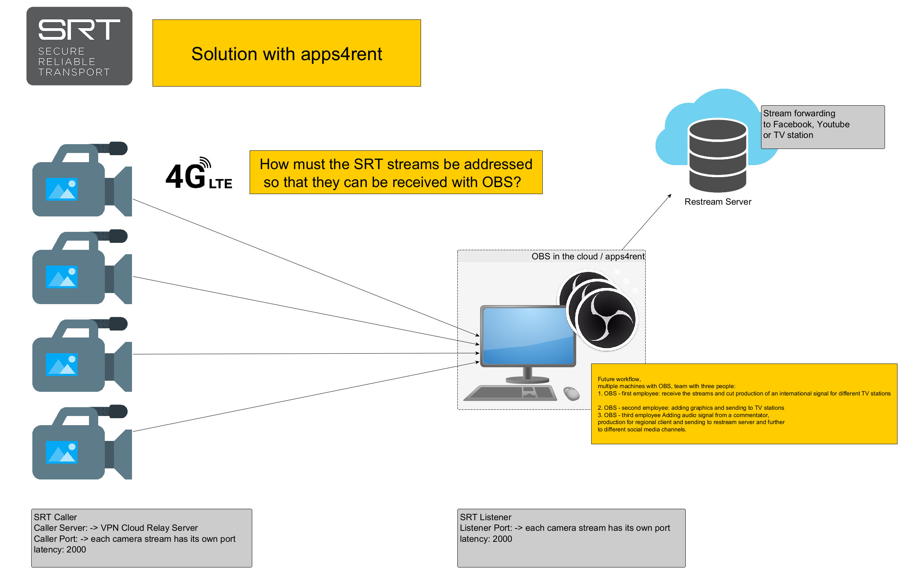

# obs-udp-srt Stream distribution
Sending a test stream, from a local OBS instance to an OBS instance in the cloud using srt-live-transmit.  
I have installed ffmpeg with the SRT library on my local "Windows 10 computer". I also have srt-live-transmit installed on my local computer.  
## send with OBS Studio to the local network to a multicast address
setting -> stream -> Server:  
`udp://224.0.0.1:9999` (multicast address on the LAN)  
## receive and view with ffplay
`C:\ffmpeg\bin>ffplay.exe udp://@224.0.0.1:9999`  
Attention: ffplay must be started first. Only then start the stream with OBS.  
## received on the local network on another computer with OBS
new Source -> Media Source -> Properties:  
Input: `udp://@224.0.0.1:9999`  
## receive on the local network and forward the stream with srt-live-transmit to OBS in the Cloud  
### srt-live-transmit
Again, it is important that srt-live-transmit is started as listener before OBS sends the stream.  
`C:\srt-live>srt-live-transmit.exe udp://@224.0.0.1:9999?mode=listener srt://xxx.xxx.xxx.xxx:10000?mode=caller`  
This does not work. Is port 10000 actually open for incoming UDP traffic?  
### ffmpeg
`C:\ffmpeg\bin>ffmpeg.exe -i udp://@224.0.0.1:9999 -c copy -f mpegts "srt://xxx.xxx.xxx.xxx:10000?mode=caller&latency=50000"`  
## Streaming from camera encoders to OBS in the cloud
SRT: `Caller`  
Caller Server: `xxx.xxx.xxx.xxx`  
Caller Port: `10000`  
latency: `2000` (2 seconds)  
## Streaming from local OBS to OBS in the cloud
`srt://xxx.xxx.xxx.xxx:10000?mode=caller`  
This does not work.  

---
**tested for a solution with apps4rent.com**  
  

---
